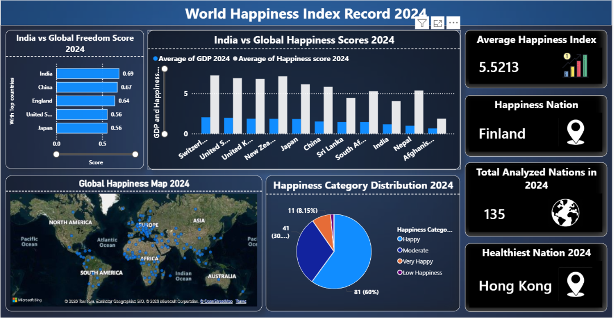
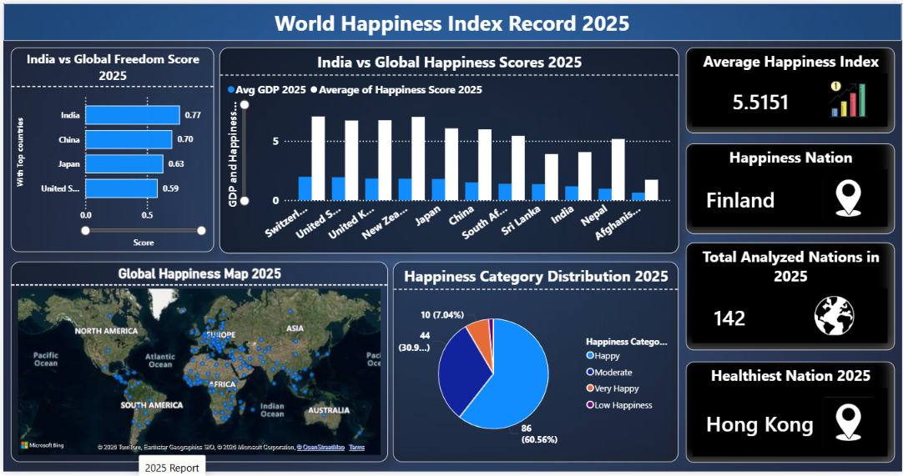
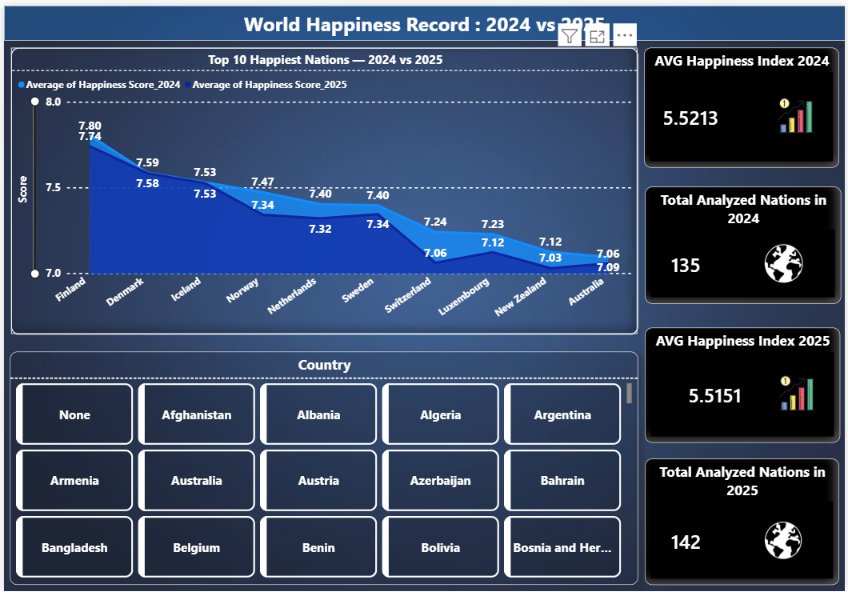

# 🌍 World Happiness Index Dashboard of 2024 and 2025

##  Project Overview
I created this dashboard project for our Course Project of data Analysis

This project is based on the **World Happiness Report 2024 and 2025** datasets.  
I created this dashboard in **Power BI** to analyze and compare happiness scores, freedom scores, GDP, and overall happiness trends across different countries.

The main goal of this project is to understand dataset and  how happiness levels vary around the world and compare the changes between 
**2024 and 2025** using interactive dashboards.

---

## 🛠️ Tools Used
- Power BI
- Microsoft Excel
- Data Analysis
- Dashboard Design

---

## 📂 Project Files
- `CP_Final_dashboards.pbix` → Main Power BI dashboard file  
- `WHR24_Data_Figure_Final.xlsx` → 2024 Dataset  
- `WHR25_Data_Figure_final.xlsx` → 2025 Dataset  
- `WHR_Comparison_2024_vs_2025.xlsx` → Comparison dataset between 2024 and 2025  

---

## 📊 Dashboard Features

### 1. World Happiness Dashboard 2024
This dashboard shows:
- Average Happiness Index (2024)
- Happiest nation
- Total analyzed nations
- Healthiest nation
- Global happiness map
- Happiness category distribution
- India vs Global comparison

### Screenshot

---

### 2. World Happiness Dashboard 2025
This dashboard includes:
- Average Happiness Index (2025)
- Happiest nation
- Total analyzed nations
- Healthiest nation
- Global happiness map
- Happiness category distribution
- India vs Global comparison

### Screenshot

---

### 3. 2024 vs 2025 Comparison Dashboard
This dashboard compares:
- Top happiest nations
- Average happiness score changes
- Country-wise comparison
- Total analyzed nations
- Happiness trend between both years

### Screenshot

---

##  Key Insights
- Finland remained the happiest nation in both years.
- Average happiness index changed slightly from 2024 to 2025.
- Most countries fall under the Happy and Moderate categories.
- Happiness levels are influenced by factors like GDP, freedom score, and health indicators.
- The comparison dashboard helps identify country-wise changes clearly.

---

##  Learning Outcome
By doing this project, I improved my skills in:
- Power BI dashboard building
- Data cleaning and visualization
- Dataset comparison
- Finding insights from real-world data

---

##  Conclusion
This project helped me understand how data clean and visualization can be used to explain global trends in a simple and interactive way. 
The dashboards make it easier to understand and compare happiness indicators and study patterns like related to wroldwide.

